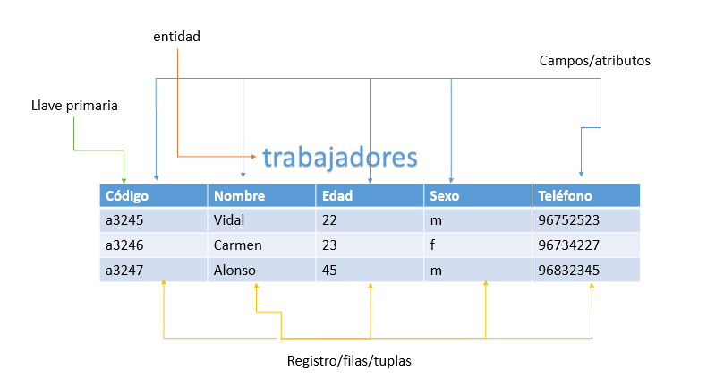
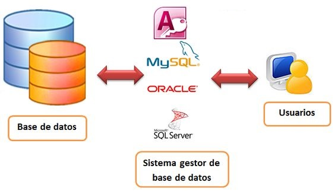
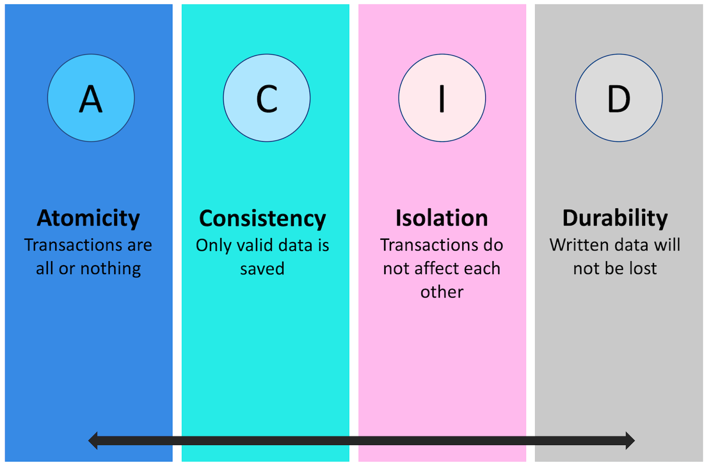
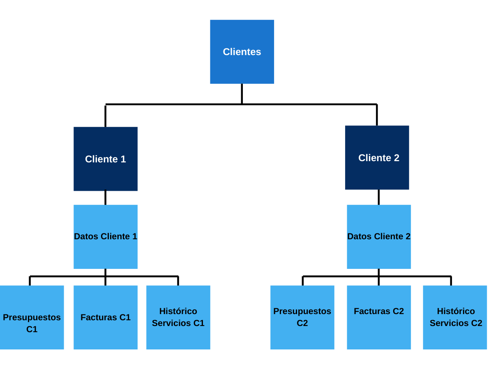
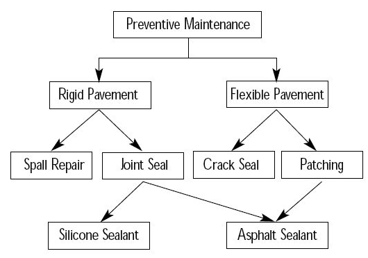
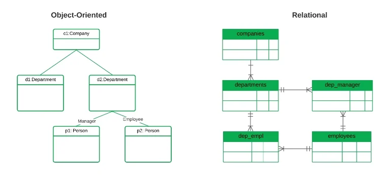
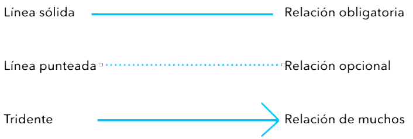

# Fundamentos de las Bases de Datos.
## 1. Introducción. Contexto histórico.
- No fue hasta el siglo 20 cuando se encontró una forma de almacenar información de manera infinita durante miles de años: el microfilm.
    Desventaja: modificar la información es muy complicado.
- Con el inicio de la era digital aparecieron los CD's y los discos duros, que almacenan la información en forma de bits.
- Ahora, la última metodología de almacenamiento es la nuve que presenta infinidad de ventajas respecto a sus predecesores.

## 2. Definiciones iniciales.
- **Base de datos**
    - <u>Concepto intuitivo</u>:
        - Ligar en el que se almacena toda la información sobre algo en concreto, para después poder consultarla.
        - Lugar en el que se puede consultar toda la información rgistrada sobre algo concreto.
        - Fondo común de información almacenada, para que cualquier persona o entidad autorizada pueda acceder a ella, independientemente del lugar de procedencia y del uso que se haga.
    - <u>Concepto técnico</u>:
        - Es una colección de datos relacionados lógicamente entre sí, con una definición y descripción comunes y que están estructurados de una determinada manera.
        - Es un conjunto estructurado de datos que representa entidades y interrelaciones, almacenados con la mínima redundancia y posibilitando el acceso a ellos eficientemente.
        - Las bases de datos no solo almacenan datos, sino también una descripción de los mismos.

- **Elementos**
    - <u>Entidades</u>
        - Objeto real o abstracto con características diferenciadoras de otros, del que se almacenan información en la base de datos. 
        - Si pensamos en una academia, algunos ejemplos de entidades: profesores, alumnos, asignaturas,...
    - <u>Atributos</u>
        - Son los datos que se almacenan sobre la entidad. 
        - Cualquier característica de una entidad puede ser un atributo.
        - Siguiendo con el ejemplo, si hablamos de alumnos: nombre, apellidos, numero identificador, fecha de ingreso,..
    - <u>Registro</u>
        - Lugar en el que se almacena la información de cada entidad.
        - Es un conjunto de atributos que contienen los datos que pertenecen a la misma entidad.
    - <u>Campos</u>
        - Lugar en el que se almacenan los campos de cada registro.

     
    

      
    

 
## 3. Sistemas gestores de Bases de Datos (SGBD).
- Es una herramienta software, más o menos compleja, que permite la creación y gestión de una Base de Datos.
- El SGBD es la herramienta que se encarga de organizar los datos, manteniendo la información siempre accesible para el usuario de la forma más eficientes posible, tanto en espacio como en velocidad de acceso.
- Estos sistemas pueden clasificarse en función de la manera que tienen de administrar los datos.
    - Relacionales (**SQL**)
    - No relacionales (**NoSQL**)

     
    

      
    

     

- **<u>Características mínimas de un SGBD</u>**
    - **CRUD**
        - Acrónimo de las 4 operaciones básicas que cualquier SGBD debe tener.
            - Create
            - Read
            - Update
            - Delete
    
    - **Recuperación de información**
        - Se espera que la información se pueda leer (READ) y también que cualquier fragmento de información pueda recuperarse de diferentes formas.
    
    - **Consistencia**
        - Los resultados de una búsquda deben ser consistentes, de manera que si realizamos la misma consulta 2 veces, debemos obtener el mismo resultado.
        - Un mismo dato no puede tener más de un resultado posible.
    
    - **Velocidad**
        - La información se debe poder crear, modificar, borrar y leer de forma rápida y ágil.
        - Esto también depende del buen o mal diseño de la BBDD.

    - **Validez**
        - El SGBD debe proporcionar mecanismos que permitan validar la información que se registra en la BBDD.
    
    - **Persistencia y soporte para Backups**
        - La información de una BBDD debe ser persistente, o en otras palabras, no debe desapareces.
        - Ante situaciones imprevistas como borrados accidentales, se necesitarán herramientas para crear y restaurar los Backups.
    
    - **Capacidad de extender sus características**
        - Debemos tener la capacidad de incorporar nuevas características a la base de datos a medida que pasa el tiempo.

    - **Seguridad**
        - Debe haber mecanismo que protejan la información almacenada en la BBDD.
        - Al menos, se deberá contar con una buena gestión de cuentas de usuario y privilegios en cuanto a los accesos de los diferentes usuarios SGBD.

- **<u>Funciones de un SGBD</u>**
    - **Crear y organizar la BBDD**
        - Los SGBD crean y administran las BBDD, abstrayendo a sus usuarios de cómo y dónde se organizan todo internamente.
    
    - **Control de acceso**
        - La mayoría de los SGBD incorporan un control en el acceso a la información mediante un sistema de cuentas de usuarios con diferentes privilegios.
        - El adminitrados podrá decidir qué permisos tienen cada usuario(lectura, escritura,..)

    - **Evitar la redundacia y la inconsistencia**
        - Es importante asegurar que un dato no se encuentra duplicado en algún otro lugar de la BBDD, porque ante una actualización, es muy común que alguna de las copias duplicadas no se actualice, y aquí podríamos tener un problema de inconsistencia.

    - **Respaldo y Recuperación**
        - El SGBD debe proporcionar herramientas adicionales que, ante un fallo, permitan recuperar toda la BBDD.

    - **Evitar anomalías en el acceso concurrente**
        - Es probable que varios usuarios accedan de manera simultánea a la misma BBDD.
        - Hay que poner solución a los problemas que se puedan ocasionar con la modificación del datos realizada por varios usuarios simultáneamente.
    
    - **Garantizar la correcta ejecución de las transacciones**
        - Existen un conjunto de normas conocidas como **ACID**
        - Son las características que todo SGBD debe soportar para un buen funcionamiento de las transacciones.
            - **Atomicity**
                    
                    Se debe asegurar si la operación se ha llevado a cabo o no. No existen los términos medios.
            - **Consistency**

                    Las transacciones que se ejecutan deben terminar sin romper la integridad de la Base de Datos.
            - **Isolation**

                    Si se ejecutan operaciones concurrentes sobre los mismo datos, deben ser independientes y no generar ningún error.
            - **Durability**

                    Las operaciones deben persistir en el tiempo, no se pueden deshacer.

        - [Más infomación sobre ACID](https://es.wikipedia.org/wiki/ACID)

         
        

          
        

         

## 4. Modelos de datos.

### ¿Qué es un modelo?
    El mecanismo formal para representar y manipular información de manera general y sistemática dentro de una base de datos.

---

### Existen varios tipo de Modelos de Base de datos:
#### <u>Modelo jerárquico</u>
- Son BD que, como su propio nombre indica, almacena la información en una estructura jerarquizada.
- Los datos se organizan de una forma similar a un árbol invertido, con un nodo raíz, nodos pare e hijos.
- Un nodo padre puede tener iliminatos nodos hijos pero un nodo hijo sólo puede corresponder a un padre.
- El objetivo de estas BD es gestionar grandes volúmenes de datos.
- El concepto de este modelo se basa en representar situaciones de la vida real en las que predominan las relaciones de tipo 1 a varios (1:N)
- La estructura de árbol no puede modificarse una vez ha quedado establecida.
 

    

 

- **Ventajas**
    -  Las conexiones desntro del árbol son fijas, por lo que la navegación es rápida.
    - La estructura es fácil de ver y de comprender.
    - Permite predefinir algunas relaciones, y esto simplifica las posibles variaciones futuras.
    - Mantiene la independencia de los datos
    - Permite mantener la integridad de la información.

- **Desventajas**
    - Escasa independencia entre los nodos, ya que para acceder a ellos hay que pasar por los padres, y esto quita flexibilidad a la navegación.
    - Mala gestión de la redundancia, puesto que si un registro tiene relación con dos o más registros, debe almacenarse varias veces( un hijo no puede tener dos padres).
    - Lo anterior implica un mayor volumen de datos y posibles problemas en la integridad, ya que ante una posible modificación de datos es necesario modificar todas las copias.
    - Modificar estas bases de datos es complejo porque son muy rígidas.

---

#### <u>Modelo en red</u>
- Aparece como respuesta a las limitaciones del modelo jerárquico.
- Ambos modelos tienen características similares pero con una relación menos rígida entre los padres y los nodos hijos.
- Los nodos hijos van a poder tener distintos nodos padres.
- También existen niveles jerárquicos pero un nodo hijo puede ser miembro de un conjunto, y al mismo tiempo, padre en otro conjunto diferente.

 

    

 

- **Ventajas**
    - Posibilidad de establecer relaciones de muchos a muchos(N:N)
    - Es más flexible que el modelo jerárquico porque los datos pueden conectarse de muchas formas diferentes.
    - Son BD fáciilmente escalabes, porque pueden agregar nuevas entidades y relaciones sin cambiar la estructura de la BD.

- **Desventajas**
    - El coste de implementar y mantener estas BD es significativamente alto.
    - Son bases de datos que pueden llegar a ser muy complejas y esta complejidad va en aumento cuanto mayor volumen de información se almacene.
    - Es necesario tener conocimientos muy técnicos para diseñarlas y administrarlas.
---

#### <u> Modelo orientado a objetos</u>
- Surge como una evolución de los modelos relacionales y de red.
- Integra conceptos de la programación orientada a objetos.
- Los datos y las operaciones sobre estos se encapsulan en objetos.
- Los objetos pueden heredar características de otros objetos, facilitando la reutilización y organización del código.

     
    

        
    

     

- **Ventajas**
    - Facilita la representación de problemas complejos, modelándolos de manera más natural.
    - Promueve la reutilización de código gracias a la herencia y el polimorfismo.
    - Mejora el mantenimiento y la extensibilidad de las aplicaciones, ya que los cambios en un objeto no afectan directamente a otros objetos.
    - Aumenta la consistencia y la integridad de los datos al agrupar tanto datos como métodos en un solo objeto.

- **Desventajas**
    - Mayor coste de implementación y mantenimiento debido a su complejidad.
    - Requiere un cambio de paradigma significativo para los desarrolladores acostumbrados a los modelos tradicionales.
    - Puede ser menos eficiente en términos de rendimiento para ciertos tipos de consultas, en comparación con las bases de datos relacionales.
    - La curva de aprendizaje es más pronunciada, especialmente para aquellos sin experiencia en programación orientada a objetos.

## 5. Modelo de datos relacional.

La característica más representativa del modelo relacional es que impone unas relaciones entre los datos que permiten realizar operaciones de forma sencilla.

## Base de Datos Relacional

Una **BD relacional** es:
- Un conjunto de tablas (o relaciones) formadas por filas (registros) y columnas (campos).
- Cada registro (fila) tiene una `ID única` denominada clave primaria.
- Las columnas de la tabla contienen los atributos de los datos.
- Cada registro tiene normalmente un valor para cada atributo, lo que simplifica la creación de relaciones entre los datos.

Ejemplos de BBDD: Oracle, DB2, SqlServer, MySql, ...

## Entidades

El objeto más básico de este modelo es la `entidad`:
- La entidad refleja un elemento o información real que queremos guardar en la BBDD: cliente, factura, vehículo, ...

### Atributos

Las entidades tienen `atributos` o características que la identifican:
- Pueden ser obligatorios (*) u opcionales (o).

Cada ocurrencia de una entidad se denomina `tupla` o `registro`.

### Clave Primaria

Entre los atributos se debe identificar una `clave primaria` (#):
- Es un valor que identifica de forma única a cada tupla de la entidad.
- Puede ser una combinación de atributos.

### Foreign Key

- Es la clave que relaciona la tabla Maestra con la tabla Detalle.
- Es una columna de la tabla Detalle que apunta a la clave primaria de la tabla maestra.

## Concepto de Relaciones

Las relaciones son una de las características más importantes del modelo relacional:
- Son las que `van a determinar cómo se comunican las diferentes entidades`, y cómo van a permitir implementar estructuras jerárquicas entre padres e hijos.
- Esto supone que vamos a tener tablas Maestras-Padres y tablas Detalle-Hijas.

Para modelar y representar estas relaciones, se utilizan algunos símbolos y elementos:

## Relaciones entre Tablas

Las relaciones entre tablas pueden ser de varios tipos:

### 1. Relaciones Uno a Uno (1:1)

En una relación uno a uno, cada fila de una tabla está relacionada con una sola fila de otra tabla, y viceversa. Se utiliza principalmente para dividir una tabla grande en tablas más pequeñas para una mayor eficiencia y para almacenar información opcional que se utiliza con poca frecuencia.

### 2. Relaciones Uno a Muchos (1:N)

En una relación uno a muchos, una fila de una tabla puede estar relacionada con muchas filas de otra tabla. Es el tipo de relación más común y se utiliza, por ejemplo, para relacionar una tabla de clientes con una tabla de pedidos, donde cada cliente puede tener varios pedidos.

### 3. Relaciones Muchos a Muchos (N:M)

En una relación muchos a muchos, muchas filas de una tabla pueden estar relacionadas con muchas filas de otra tabla. Para implementar este tipo de relación, se utiliza una tabla intermedia que contiene claves foráneas que apuntan a las tablas relacionadas. Un ejemplo sería una tabla de estudiantes y una tabla de cursos, donde cada estudiante puede estar inscrito en muchos cursos y cada curso puede tener muchos estudiantes.

## Integridad Referencial

La integridad referencial es una propiedad que garantiza que las relaciones entre las tablas permanezcan consistentes. Esto significa que si una tabla tiene una clave foránea, los valores de esa clave deben coincidir con los valores de la clave primaria en la tabla referenciada, o ser nulos. Esto evita la existencia de registros huérfanos en las tablas detalle.

### Restricciones de Integridad

- **Restricción de clave primaria:** Garantiza que los valores de la clave primaria sean únicos y no nulos.
- **Restricción de clave foránea:** Garantiza que los valores de la clave foránea correspondan a valores existentes en la clave primaria de la tabla relacionada.
- **Restricción de unicidad:** Asegura que todos los valores en una columna o conjunto de columnas sean únicos.
- **Restricción de no nulidad:** Impide que se inserten valores nulos en una columna específica.

## Normalización

La normalización es el proceso de estructurar las tablas de una base de datos para reducir la redundancia de datos y mejorar la integridad de los datos. Las formas normales (1NF, 2NF, 3NF, etc.) son reglas de normalización que guían este proceso.

### Formas Normales

1. **Primera Forma Normal (1NF):** Garantiza que todos los valores de una columna sean atómicos (indivisibles).
2. **Segunda Forma Normal (2NF):** Garantiza que todos los atributos no clave sean dependientes completamente de la clave primaria.
3. **Tercera Forma Normal (3NF):** Garantiza que no exista dependencia transitiva entre los atributos no clave y la clave primaria.

## Desnormalización

La desnormalización es el proceso de combinar tablas para mejorar el rendimiento de las consultas, a costa de una mayor redundancia de datos. Este proceso se utiliza cuando las consultas frecuentes requieren combinaciones de varias tablas, y la normalización estricta provoca un rendimiento ineficiente.

## Índices

Los índices son estructuras adicionales que permiten un acceso más rápido a los datos de una tabla. Los índices pueden ser únicos o no únicos y se crean en una o más columnas de una tabla.

### Tipos de Índices

- **Índice primario:** Generalmente creado automáticamente en la clave primaria de la tabla.
- **Índice único:** Garantiza la unicidad de los valores en una o más columnas.
- **Índice no único:** Mejora el rendimiento de las consultas sin garantizar la unicidad.

## Vistas

Las vistas son consultas almacenadas que se pueden tratar como tablas virtuales. Las vistas permiten simplificar consultas complejas, proporcionar seguridad de datos al mostrar solo ciertas columnas y filas, y proporcionar una capa de abstracción sobre las tablas reales.

### Ventajas de las Vistas

- Simplificación de consultas complejas.
- Mejora de la seguridad de los datos.
- Proporciona una capa de abstracción.

---
---

# Bases de Datos NoSQL

Las bases de datos NoSQL son un tipo de sistema de gestión de bases de datos que no se basa en el modelo relacional tradicional. Estas bases de datos están diseñadas para gestionar grandes volúmenes de datos, ofrecer escalabilidad horizontal y proporcionar alta disponibilidad. 

## Características Principales

- **No utilizan SQL:** Las bases de datos NoSQL no usan el lenguaje SQL estándar para realizar consultas.
- **Modelos de datos flexibles:** Pueden manejar datos semi-estructurados o no estructurados.
- **Escalabilidad horizontal:** Permiten añadir más servidores para manejar el aumento de la carga de trabajo.
- **Alta disponibilidad:** Diseñadas para minimizar el tiempo de inactividad y proporcionar redundancia.
- **Rendimiento:** Optimizadas para operaciones de lectura/escritura rápidas.

## Tipos de Bases de Datos NoSQL

Existen varios tipos de bases de datos NoSQL, cada uno diseñado para diferentes tipos de aplicaciones y cargas de trabajo.

### 1. Bases de Datos de Documentos

- **Descripción:** Almacenan datos en documentos similares a JSON o XML. Cada documento es autónomo y puede tener una estructura diferente.
- **Ejemplos:** MongoDB, CouchDB.
- **Usos:** Aplicaciones web, gestión de contenido, aplicaciones móviles.

### 2. Bases de Datos de Clave-Valor

- **Descripción:** Almacenan datos como pares clave-valor. Son muy rápidas para operaciones simples de lectura/escritura.
- **Ejemplos:** Redis, Riak, DynamoDB.
- **Usos:** Cachés, sesiones de usuario, almacenamiento de configuraciones.

### 3. Bases de Datos de Columnas

- **Descripción:** Almacenan datos en columnas en lugar de filas. Están optimizadas para consultas en columnas específicas.
- **Ejemplos:** Apache Cassandra, HBase.
- **Usos:** Análisis de datos, almacenamiento de registros, aplicaciones que requieren alta escritura.

### 4. Bases de Datos de Grafos

- **Descripción:** Utilizan grafos para representar y almacenar datos. Son ideales para manejar relaciones complejas.
- **Ejemplos:** Neo4j, ArangoDB, OrientDB.
- **Usos:** Redes sociales, recomendaciones, sistemas de gestión de identidades.

## Comparación con Bases de Datos Relacionales

| Característica          | Bases de Datos Relacionales | Bases de Datos NoSQL    |
|-------------------------|-----------------------------|-------------------------|
| Modelo de Datos         | Tablas (filas y columnas)   | Diversos (documentos, clave-valor, columnas, grafos) |
| Lenguaje de Consulta    | SQL                         | Variado (dependiendo del tipo) |
| Escalabilidad           | Vertical (mejorar hardware) | Horizontal (añadir más servidores) |
| Estructura de Esquema   | Fija                        | Flexible                |
| Consistencia            | ACID                        | Eventual (en muchos casos) |

## Ventajas y Desventajas

### Ventajas

- **Flexibilidad del esquema:** Permiten cambios en la estructura de datos sin necesidad de modificar toda la base de datos.
- **Escalabilidad:** Fáciles de escalar horizontalmente para manejar grandes volúmenes de datos.
- **Rendimiento:** Optimizadas para operaciones rápidas de lectura y escritura.

### Desventajas

- **Consistencia:** En algunos casos, pueden sacrificar consistencia por disponibilidad y partición.
- **Manejo de consultas complejas:** No todas las bases de datos NoSQL soportan consultas complejas como las relacionales.
- **Ecosistema maduro:** Menos herramientas maduras en comparación con las bases de datos relacionales.

## Casos de Uso

- **Big Data:** Manejo y análisis de grandes volúmenes de datos.
- **Aplicaciones en Tiempo Real:** Sistemas que requieren respuesta inmediata.
- **IoT (Internet of Things):** Almacenamiento y procesamiento de datos generados por dispositivos IoT.
- **Aplicaciones Web y Móviles:** Gestión flexible de datos para aplicaciones dinámicas.

## Ejemplos de Bases de Datos NoSQL

- **MongoDB:** Base de datos de documentos, popular por su flexibilidad y escalabilidad.
- **Redis:** Base de datos en memoria de clave-valor, conocida por su velocidad.
- **Cassandra:** Base de datos de columnas, ideal para manejar grandes volúmenes de datos distribuidos.
- **Neo4j:** Base de datos de grafos, utilizada para aplicaciones que requieren modelado de relaciones complejas.

