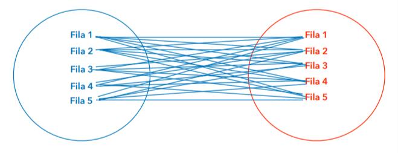
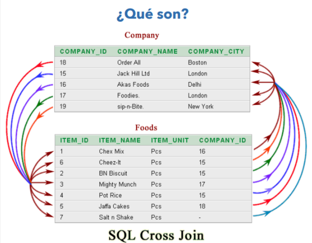
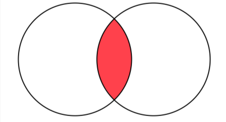
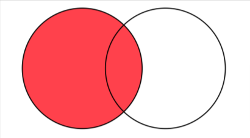
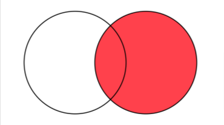

# JOINS - Uniones entre tablas
## ¿Qué son los JOINS?
- Para extraer información de varias tablas, se utilizan habitualmente los JOINS
- Para poder extraer esta información, **los datos (o más específicamente, las tablas) tienen que estar relacionados** de alguna manera.
- Las tablas suelen estar unidas de alguna manera con el concepto *Padre* e *Hija* (en este caso, la segunda depende de la primera)

---

### Tipos ( CROSS JOINS - INNER JOINS - RIGHT JOINS - LEFT JOINS )
- **CROSS JOINS**
    - Poco habituales.
    - Se hace un cruce completo de las tablas: relaciona **CADA FILA** de una tabla con **TODAS LAS FILAS** de la otra tabla.

        
        

- **INNER JOINS**
    - Más habituales.
    - Devuelven los registros de las dos tablas que coinciden en valores.

        

- **LEFT JOINS**
    - Muy habituales.
    - Se devuelven todos los registros de la primera tabla y los registros de la segunda que coincidan en valores.
    - Los datos que no coinciden, aparecen como **nulos**,

        

- **RIGHT JOINS**
    - Igual que LEFT JOIN pero con la segunda tabla en lugar de la primera.
    - Se devuelven todos los registros de la segunda tabla y los registros de la primera que coincidan en valores.
    - Los datos que no coinciden, aparecen como **nulos**

        
